<div align="center">

# 🕸️ DisasterMesh Sentinel

### AI-Powered Self-Organizing Emergency Communication Network

<p>
  <strong>Keep emergency communication alive when cellular service and the Internet disappear.</strong>
</p>

<p>
  <em>No cell tower. No cloud dependency. Still connected.</em>
</p>

<p>
  <a href="#-overview">Overview</a> ·
  <a href="#-problem">Problem</a> ·
  <a href="#-solution">Solution</a> ·
  <a href="#-demo">Demo</a> ·
  <a href="#-architecture">Architecture</a> ·
  <a href="#-getting-started">Getting Started</a> ·
  <a href="#-team">Team</a>
</p>

<p>
  <a href="[REPOSITORY_URL]">
    
  </a>
  <a href="[REPOSITORY_URL]/actions">
    
  </a>
  <a href="[REPOSITORY_URL]/issues">
    
  </a>
  <a href="[REPOSITORY_URL]/pulls">
    
  </a>
  <a href="LICENSE">
    
  </a>
</p>

<p>
  <a href="[LIVE_DEMO_URL]">🚀 Live Demo</a> ·
  <a href="[DEMO_VIDEO_URL]">🎥 Watch Demo</a> ·
  <a href="[PRESENTATION_URL]">📊 Pitch Deck</a> ·
  <a href="[DOCUMENTATION_URL]">📚 Documentation</a>
</p>

</div>

---

## 🧭 Table of Contents

- [Overview](#-overview)
- [Hackathon Context](#-hackathon-context)
- [Problem](#-problem)
- [Solution](#-solution)
- [Core Capabilities](#-core-capabilities)
- [How It Works](#-how-it-works)
- [Demo](#-demo)
- [Screenshots](#-screenshots)
- [Architecture](#-architecture)
- [Technology Stack](#-technology-stack)
- [MVP Scope](#-mvp-scope)
- [Getting Started](#-getting-started)
- [Usage](#-usage)
- [Testing and Quality Assurance](#-testing-and-quality-assurance)
- [Security and Responsible AI](#-security-and-responsible-ai)
- [Limitations](#-limitations)
- [Roadmap](#-roadmap)
- [Team](#-team)
- [Acknowledgements](#-acknowledgements)
- [License](#-license)

---

## 🌐 Overview

**DisasterMesh Sentinel** is an offline-first emergency communication and coordination platform designed for situations where cellular infrastructure, Internet access, or cloud services become unavailable.

The system uses nearby devices as temporary relay nodes. Emergency reports can be created locally, structured using AI-assisted triage, prioritized using emergency rules, forwarded through nearby devices, and synchronized when any connected node regains Internet access.

> **Our core idea:** When infrastructure fails, nearby devices should still be able to exchange life-critical information.

<div align="center">

```text
Detect → Understand → Prioritize → Relay → Coordinate → Sync
```

</div>

---

## 🕸️ Hackathon Context

DisasterMesh Sentinel was created for:

# HackVerse: Into the Web

**HackVerse: Into the Web** is a Spider-Man-themed, story-driven hackathon organized by the **IEEE Robotics and Automation Society, VIT Chennai Student Chapter**, as part of **TechnoVIT 2026**.

Unlike a conventional hackathon, HackVerse is structured as a 24-hour journey through three progressively challenging sprints:

| Sprint | Focus | Challenge |
|---|---|---|
| 🕸️ Web-Slinger Sprint | Rapid Vibe Coding | Turn an idea into a functional prototype using modern tools and frameworks. |
| 🕷️ Spider-Sense Sprint | Competitive Coding | Solve algorithmic, logical, and DSA-based challenges under time pressure. |
| 🌌 Multiverse Sprint | Real-World Product Building | Build, deploy, and present a functional product with meaningful technical implementation. |

### Open Innovation

HackVerse does not impose a fixed problem statement, domain, or technology stack. Teams are encouraged to build solutions across areas such as:

- Artificial intelligence.
- Robotics and IoT.
- Cybersecurity.
- Fintech.
- Healthcare.
- Automation.
- Web3.
- Sustainability.
- Emergency response.

### HackVerse Mission

```text
Take an idea.
Build it.
Deploy it.
Prove it.
```

> **With great power comes great responsibility.**

---

## 🚨 Problem

During floods, earthquakes, fires, cyclones, infrastructure failures, and other emergencies, the communication systems people depend on may become unreliable.

### Connectivity collapse

Power outages, damaged towers, congestion, and backhaul failures can disconnect entire communities.

### Critical information gets buried

A trapped-person message may look identical to a routine request in an ordinary chat stream.

### Help is local, but coordination is not

People may be physically close enough to help one another, but lack a shared communication layer that works without the Internet.

### Evidence is difficult to transfer

Images, audio recordings, and other evidence can be too large or unreliable to transmit over unstable connections.

### Response becomes fragmented

Reports, locations, available resources, and acknowledgements are often stored in disconnected channels.

---

## 💡 Solution

DisasterMesh Sentinel turns nearby smartphones and edge devices into a temporary, self-organizing emergency network.

The platform combines:

- Local emergency reporting.
- Offline message storage.
- Nearby peer discovery.
- Multi-hop store-and-forward relay.
- AI-assisted incident triage.
- Severity-aware message prioritization.
- Geotagged emergency visualization.
- Deferred synchronization.
- Human-governed response workflows.

A message does not need to travel directly from the reporter to the cloud.

```text
Phone A → Phone B → Relay Node → Coordinator → Cloud Sync
```

If one node loses connectivity, the message can remain queued locally and continue moving when another relay opportunity becomes available.

---

## ⚙️ Core Capabilities

### 📡 Offline-first communication

Create and store emergency messages locally without depending on cellular data or continuous Internet access.

### 🕸️ Multi-hop relay

Forward incident bundles through nearby devices using store-and-forward routing.

### 🧠 AI-assisted triage

Extract structured information from text or voice input, including:

- Intent.
- Emergency category.
- Severity.
- Urgency.
- Location.
- Affected people.
- Requested resources.
- Relevant entities.
- Possible duplicate reports.

AI output is treated as a recommendation, not an automatic authorization.

### 🚨 Priority-aware routing

Critical reports are placed ahead of routine updates and large media payloads.

Example priority model:

```text
P0 — Immediate threat to life
P1 — Serious injury or urgent rescue
P2 — Infrastructure or shelter requirement
P3 — Routine update or non-critical request
```

### 🗺️ Emergency heatmap

Aggregate geotagged reports into a local emergency view to help coordinators identify clusters, severity zones, and resource requirements.

> Heatmap accuracy depends on available location data, report quality, synchronization, and the scope of the deployed prototype.

### 🧾 Deferred synchronization

Persist messages locally and synchronize them with the cloud when any node regains Internet access.

### 🔐 Evidence-aware transfer

Text and location information can be sent first, while images and audio are transferred later through resumable upload mechanisms.

### 👥 Human-governed coordination

Authorized coordinators can:

- Review reports.
- Verify AI-generated classifications.
- Acknowledge incidents.
- Assign resources.
- Track status.
- Inspect audit history.

---

## 🔄 How It Works

```mermaid
flowchart LR
    A[Emergency Report] --> B[Local Storage]
    B --> C[AI-Assisted Structuring]
    C --> D[Priority Engine]
    D --> E[Offline Relay Queue]
    E --> F[Nearby Device]
    F --> G[Coordinator Dashboard]
    G --> H[Human Verification]
    H --> I[Resource Assignment]
    I --> J[Cloud Synchronization]
```



### End-to-end workflow

| Stage | Description |
|---|---|
| 1. Detect | A user records an emergency report locally. |
| 2. Understand | Text or voice input is converted into structured information. |
| 3. Prioritize | Emergency rules assign urgency and delivery priority. |
| 4. Queue | The report is encrypted and placed in a local relay queue. |
| 5. Relay | Nearby devices forward the report through available paths. |
| 6. Coordinate | A responder reviews and acknowledges the report. |
| 7. Sync | The system synchronizes with the cloud when connectivity returns. |

---

## 🎥 Demo

### Demo Video

> Replace the placeholder below with your final demonstration video.

[]([DEMO_VIDEO_URL])

```text
Demo URL:
[DEMO_VIDEO_URL]
```

### Suggested demonstration scenario

1. Disable Internet or cellular connectivity.
2. Phone A creates a critical SOS report.
3. The system extracts the emergency context.
4. The report receives a high priority.
5. Phone B acts as a relay node.
6. The report reaches Phone C or a local coordinator.
7. Phone C regains Internet access.
8. The incident synchronizes with the dashboard.
9. A coordinator acknowledges the incident.
10. A simulated resource assignment is created.

### Demo evidence checklist

- [ ] Offline message creation.
- [ ] Local persistence.
- [ ] Peer discovery.
- [ ] Relay queue.
- [ ] Multi-hop forwarding.
- [ ] Priority assignment.
- [ ] Heatmap or map visualization.
- [ ] Coordinator dashboard.
- [ ] Human acknowledgement.
- [ ] Deferred cloud synchronization.
- [ ] Error and recovery behavior.

---

## 🖼️ Screenshots

Replace the placeholders with screenshots stored in the repository.

### Emergency reporting

<p align="center">
  
</p>

> Replace `docs/screenshots/emergency-report.png` with the actual screenshot path.

### Offline relay queue

<p align="center">
  
</p>

### Emergency heatmap

<p align="center">
  
</p>

### Coordinator dashboard

<p align="center">
  
</p>

### Architecture overview

<p align="center">
  
</p>

### Recommended screenshot structure

```text
docs/
└── screenshots/
    ├── emergency-report.png
    ├── relay-queue.png
    ├── emergency-heatmap.png
    ├── coordinator-dashboard.png
    └── architecture.png
```

---

## 🧱 Architecture

### High-level architecture

```text
┌──────────────────────┐
│ Reporter Device      │
│ Text / Voice / Image │
└──────────┬───────────┘
           │
           ▼
┌──────────────────────┐
│ Local Data Layer     │
│ Queue / Encryption   │
└──────────┬───────────┘
           │
           ▼
┌──────────────────────┐
│ Triage Layer         │
│ AI Recommendation    │
└──────────┬───────────┘
           │
           ▼
┌──────────────────────┐
│ Priority Engine      │
│ TTL / Replication    │
└──────────┬───────────┘
           │
           ▼
┌──────────────────────┐
│ Peer Relay Layer     │
│ Nearby Store-Forward │
└──────────┬───────────┘
           │
           ▼
┌──────────────────────┐
│ Coordinator Layer    │
│ Review / Acknowledge │
└──────────┬───────────┘
           │
           ▼
┌──────────────────────┐
│ Cloud Sync Layer     │
│ Dashboard / Analytics│
└──────────────────────┘
```

### Offline mode

```text
Reporter → Local Storage → Priority Queue → Nearby Relay → Nearby Relay
```

### Connected mode

```text
Device → API / WebSocket → Backend → Database → Coordinator Dashboard
```

### Recovery mode

```text
Offline Incident → Local Queue → Connectivity Returns → Deferred Sync
```

### Design principles

- Local-first data persistence.
- Text and location before large media.
- Store-and-forward delivery.
- Severity-aware routing.
- Explicit human authority.
- Preserved original input.
- Auditable state transitions.
- Graceful degradation.
- No dependence on a single communication path.

---

## 🛠️ Technology Stack

> Update this table to match the technologies actually present in the repository.

| Layer | Technology | Purpose |
|---|---|---|
| Mobile client | `[ANDROID / WEB / OTHER]` | Reporter and relay experience |
| Frontend | `[REACT / NEXT.JS / OTHER]` | User interface and dashboard |
| Backend | `[FASTAPI / NODE.JS / OTHER]` | API and coordination services |
| Database | `[POSTGRESQL / SQLITE / OTHER]` | Incident and user data |
| Local storage | `[ROOM / INDEXEDDB / SQLITE / OTHER]` | Offline persistence |
| Peer connectivity | `[WI-FI DIRECT / BLE / WEBRTC / OTHER]` | Nearby device communication |
| AI layer | `[MODEL / LOCAL MODEL / API / OTHER]` | Triage recommendations |
| Mapping | `[MAP LIBRARY / OTHER]` | Incident visualization |
| Deployment | `[PLATFORM]` | Hosting and delivery |
| CI/CD | `[GITHUB ACTIONS / OTHER]` | Automated quality checks |

### Repository technology badges

Replace the placeholders with the technologies actually used:

<p>
  
  
  
</p>

---

## 🎯 MVP Scope

### Included in the prototype

- [x] Emergency report creation.
- [x] Local-first report handling.
- [x] Priority-aware incident representation.
- [x] Relay-oriented communication model.
- [x] Structured emergency data.
- [x] Coordinator-oriented workflow.
- [x] Heatmap concept.
- [x] Deferred synchronization concept.
- [x] Human verification boundary.
- [ ] Replace this checklist with the exact tested implementation.

### Prototype boundary

This project is a hackathon prototype. Some capabilities may be simulated, partially implemented, or dependent on the selected runtime environment.

The repository documentation should clearly distinguish between:

- Implemented.
- Demonstrated.
- Simulated.
- Planned.
- Not yet verified.

---

## 🏁 Getting Started

### Prerequisites

Install the prerequisites required by the actual repository:

```text
[REQUIRED_RUNTIME]
[REQUIRED_PACKAGE_MANAGER]
[REQUIRED_DATABASE]
[REQUIRED_MOBILE_SDK]
[REQUIRED_ENVIRONMENT_VARIABLES]
```

### Clone the repository

```bash
git clone [REPOSITORY_URL]
cd [REPOSITORY_DIRECTORY]
```

### Install dependencies

Use the package manager defined by the repository lockfile:

```bash
[INSTALL_COMMAND]
```

Examples:

```bash
npm install
```

```bash
pnpm install --frozen-lockfile
```

```bash
pip install -r requirements.txt
```

### Configure environment variables

Create a local environment file:

```bash
cp .env.example .env
```

Update only the values required for local development:

```env
APP_ENV=development
API_BASE_URL=[LOCAL_API_URL]
DATABASE_URL=[LOCAL_DATABASE_URL]
AI_PROVIDER=[AI_PROVIDER]
AI_API_KEY=[LOCAL_SECRET]
MAP_PROVIDER=[MAP_PROVIDER]
```

> Never commit `.env`, API keys, access tokens, private keys, production credentials, or real emergency data.

### Start the development environment

```bash
[DEVELOPMENT_COMMAND]
```

### Run the application

```bash
[RUN_COMMAND]
```

### Build for production

```bash
[BUILD_COMMAND]
```

### Run tests

```bash
[TEST_COMMAND]
```

### Run linting and type checks

```bash
[LINT_COMMAND]
```

```bash
[TYPECHECK_COMMAND]
```

---

## 🧪 Usage

### Reporter workflow

1. Open the emergency reporting interface.
2. Enter a text or voice report.
3. Add location and optional evidence.
4. Submit the report.
5. Review the generated incident structure.
6. Confirm or edit the report.
7. Allow the device to relay or synchronize it.

### Relay workflow

1. Enable relay mode.
2. Keep the device available to nearby peers.
3. Receive queued incident bundles.
4. Verify the relay status.
5. Forward eligible messages.
6. Preserve delivery and audit metadata.

### Coordinator workflow

1. Open the coordinator dashboard.
2. Filter incidents by severity or location.
3. Review original input and AI recommendations.
4. Verify the incident manually.
5. Acknowledge the report.
6. Assign a simulated resource.
7. Track the state transition.

---

## ✅ Testing and Quality Assurance

The project should be tested across functionality, security, accessibility, reliability, deployment, and user experience.

### Functional testing

- [ ] Emergency report creation.
- [ ] Empty report validation.
- [ ] Offline report persistence.
- [ ] Duplicate submission handling.
- [ ] Priority assignment.
- [ ] Relay queue behavior.
- [ ] Reconnect and deferred synchronization.
- [ ] Coordinator acknowledgement.
- [ ] Simulated resource assignment.
- [ ] Heatmap rendering.
- [ ] User logout and session expiry.
- [ ] Permission boundaries.

### UI and UX testing

- [ ] Mobile viewport.
- [ ] Tablet viewport.
- [ ] Desktop viewport.
- [ ] Keyboard navigation.
- [ ] Touch interaction.
- [ ] Loading states.
- [ ] Empty states.
- [ ] Error states.
- [ ] Retry states.
- [ ] Modal dismissal.
- [ ] Form validation.
- [ ] CTA behavior.
- [ ] Long text wrapping.
- [ ] Reduced-motion mode.

### Security testing

- [ ] Authentication.
- [ ] Authorization.
- [ ] Object-level access control.
- [ ] Input validation.
- [ ] Rate limiting.
- [ ] Secure file handling.
- [ ] Secret scanning.
- [ ] Dependency auditing.
- [ ] Security headers.
- [ ] Sensitive-data redaction.
- [ ] Audit logging.
- [ ] Safe error messages.

### DevSecOps testing

- [ ] CI build.
- [ ] Automated tests.
- [ ] Static analysis.
- [ ] Dependency scan.
- [ ] Secret scan.
- [ ] Container scan.
- [ ] Infrastructure scan.
- [ ] SBOM generation.
- [ ] Artifact traceability.
- [ ] Deployment approval.
- [ ] Rollback verification.

### Suggested local commands

Replace these with the commands used by the project:

```bash
[FORMAT_CHECK_COMMAND]
[LINT_COMMAND]
[TYPECHECK_COMMAND]
[UNIT_TEST_COMMAND]
[INTEGRATION_TEST_COMMAND]
[E2E_TEST_COMMAND]
[SECURITY_AUDIT_COMMAND]
[BUILD_COMMAND]
```

---

## 🔐 Security and Responsible AI

DisasterMesh Sentinel is designed around a strict distinction between AI assistance and human authority.

### AI may recommend

- Transcription.
- Translation.
- Intent.
- Emergency type.
- Severity.
- Urgency.
- Entity extraction.
- Possible duplicates.
- Suggested routing priority.

### AI must not independently authorize

- Emergency dispatch.
- Public emergency alerts.
- Medical decisions.
- Law-enforcement action.
- Evacuation orders.
- Resource allocation without authorized review.

### Security principles

- Preserve original user input.
- Keep AI output visibly labeled.
- Validate all external input.
- Enforce authorization server-side.
- Avoid exposing sensitive information in logs.
- Protect local and synchronized data.
- Use synthetic data during development.
- Record important state transitions.
- Review third-party dependencies.
- Never commit secrets.

> This prototype is not a replacement for certified emergency infrastructure, public safety systems, or professional emergency response procedures.

---

## ⚠️ Limitations

The following limitations must be updated to reflect the actual implementation:

- Device-to-device communication may depend on operating-system permissions and hardware capabilities.
- Peer discovery can be affected by distance, interference, battery level, permissions, and device compatibility.
- Local relay delivery cannot guarantee successful delivery in every physical environment.
- AI classification may produce incorrect or incomplete recommendations.
- Heatmap quality depends on report accuracy, location availability, and synchronization.
- Cloud dashboards remain unavailable until a device or gateway regains connectivity.
- Prototype security controls may not be sufficient for production emergency deployment.
- Simulated dispatch must not be interpreted as real-world emergency dispatch.
- Performance and delivery claims should be supported by measured test results before publication.

---

## 🛣️ Roadmap

### Phase 1 — Prototype

- [x] Emergency report model.
- [x] Local-first workflow.
- [x] Priority-aware incident concept.
- [x] Relay-oriented architecture.
- [x] Coordinator workflow.
- [ ] Replace with verified repository status.

### Phase 2 — Resilient networking

- [ ] Robust peer discovery.
- [ ] Multi-hop routing.
- [ ] Better duplicate suppression.
- [ ] Delivery receipts.
- [ ] Battery-aware relay selection.
- [ ] Network partition recovery.
- [ ] Resumable evidence transfer.

### Phase 3 — Emergency operations

- [ ] Responder integrations.
- [ ] Shelter and resource registry.
- [ ] Verified organization accounts.
- [ ] Audit and incident review tools.
- [ ] Offline map packages.
- [ ] Public safety workflow testing.

### Phase 4 — Responsible scale

- [ ] Formal security assessment.
- [ ] Accessibility assessment.
- [ ] Load testing.
- [ ] Disaster-recovery testing.
- [ ] Privacy review.
- [ ] External pilot with qualified stakeholders.
- [ ] Production readiness review.

---

## 📊 Success Measures

Use measured values only. Do not publish estimates as results.

| Metric | Current result | Target | Test method |
|---|---:|---:|---|
| Offline report creation rate | `[VALUE]` | `[TARGET]` | `[METHOD]` |
| Relay delivery rate | `[VALUE]` | `[TARGET]` | `[METHOD]` |
| Median relay latency | `[VALUE]` | `[TARGET]` | `[METHOD]` |
| Reconnect synchronization time | `[VALUE]` | `[TARGET]` | `[METHOD]` |
| Duplicate suppression rate | `[VALUE]` | `[TARGET]` | `[METHOD]` |
| AI triage agreement | `[VALUE]` | `[TARGET]` | `[METHOD]` |
| Battery cost per relay | `[VALUE]` | `[TARGET]` | `[METHOD]` |

---

## 👥 Team

We are a four-member team participating in HackVerse: Into the Web.

| Member | Role | Responsibility | Links |
|---|---|---|---|
| `[MEMBER_1_NAME]` | `[ROLE]` | `[RESPONSIBILITY]` | [GitHub]([GITHUB_URL]) · [LinkedIn]([LINKEDIN_URL]) |
| `[MEMBER_2_NAME]` | `[ROLE]` | `[RESPONSIBILITY]` | [GitHub]([GITHUB_URL]) · [LinkedIn]([LINKEDIN_URL]) |
| `[MEMBER_3_NAME]` | `[ROLE]` | `[RESPONSIBILITY]` | [GitHub]([GITHUB_URL]) · [LinkedIn]([LINKEDIN_URL]) |
| `[MEMBER_4_NAME]` | `[ROLE]` | `[RESPONSIBILITY]` | [GitHub]([GITHUB_URL]) · [LinkedIn]([LINKEDIN_URL]) |

### Team contact

- Email: `[TEAM_EMAIL]`
- Team name: `[TEAM_NAME]`
- Institution: `[INSTITUTION_NAME]`
- Track: Software / `[CONFIRM_TRACK]`
- Hackathon: HackVerse: Into the Web
- Event: TechnoVIT 2026

---

## 🤝 Contributing

This repository was created as a hackathon project.

Before contributing:

1. Read the project documentation.
2. Create a feature branch.
3. Use synthetic test data.
4. Do not commit secrets.
5. Add tests for behavior changes.
6. Update documentation when behavior changes.
7. Run formatting, linting, and tests locally.
8. Open a pull request with a clear description.

Suggested branch format:

```text
feature/short-description
fix/short-description
docs/short-description
security/short-description
```

Suggested commit format:

```text
feat: add offline incident queue
fix: handle duplicate relay message
docs: update local setup
test: add authorization regression test
security: harden upload validation
```

---

## 📁 Suggested Repository Structure

Update this structure according to the actual repository:

```text
.
├── app/
├── backend/
├── frontend/
├── mobile/
├── components/
├── services/
├── tests/
│   ├── unit/
│   ├── integration/
│   ├── e2e/
│   ├── security/
│   └── accessibility/
├── docs/
│   ├── architecture/
│   ├── screenshots/
│   ├── demo/
│   └── decisions/
├── public/
├── .github/
│   └── workflows/
├── .env.example
├── CONTRIBUTING.md
├── SECURITY.md
├── LICENSE
├── package.json
└── README.md
```

---

## 🏆 Acknowledgements

- IEEE Robotics and Automation Society, VIT Chennai Student Chapter.
- TechnoVIT 2026.
- HackVerse: Into the Web organizers.
- Mentors, judges, volunteers, and participants.
- Open-source maintainers whose tools enabled this project.
- Emergency-response researchers and practitioners whose work inspires responsible system design.

---

## 📜 License

Copyright © `[YEAR]` `[TEAM_OR_OWNER_NAME]`.

All rights reserved.

This repository and its contents are provided for hackathon demonstration, evaluation, and educational purposes unless otherwise stated in a written agreement.

You may not copy, modify, distribute, sublicense, publish, sell, or use this project or substantial portions of its code, design, documentation, branding, or assets without prior written permission from the owner.

For permissions, contact:

```text
[LICENSE_CONTACT_EMAIL]
```

---

<div align="center">

## 🕷️ With Great Power Comes Great Responsibility

<p>
  <strong>DisasterMesh Sentinel</strong><br>
  <em>Communicate • Prioritize • Relay • Recover</em>
</p>

<p>
  <a href="[LIVE_DEMO_URL]">Launch Demo</a> ·
  <a href="[DEMO_VIDEO_URL]">Watch Demo</a> ·
  <a href="[REPOSITORY_URL]/issues">Report an Issue</a>
</p>

</div>
