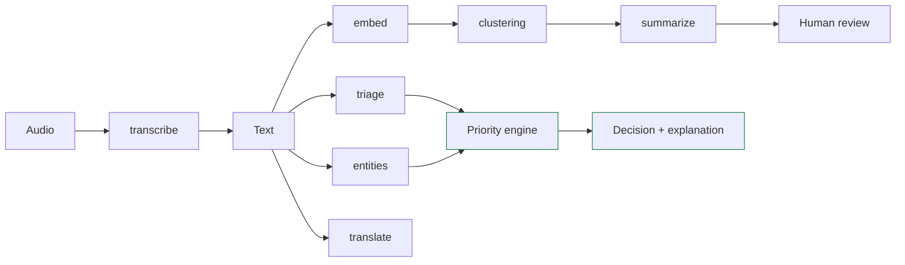

# AI Pipeline

Six tasks, each behind an interface, each replaceable, none authoritative.

## Current state

| Task | Interface | Default | Real adapter (flag) |
|---|---|---|---|
| transcribe | `mocks.transcribe` | fixture lookup | Whisper (`DMS_AI_ENABLE_WHISPER`) |
| triage | `rules.triage` | **rule engine** | XLM-R (`DMS_AI_ENABLE_TRIAGE`) |
| entities | `rules.extract_entities` | **rule engine** | mDeBERTa (`DMS_AI_ENABLE_ENTITIES`) |
| embed | `mocks.embed` | hashed bag-of-words | multilingual-e5 (`DMS_AI_ENABLE_EMBEDDINGS`) |
| translate | `mocks.translate` | glossary | NLLB-200 (`DMS_AI_ENABLE_TRANSLATION`) |
| summarize | `mocks.summarize` | deterministic aggregation | Llama/Qwen (not wired) |

No model weights have ever been downloaded — see KNOWN_LIMITATIONS §2.

## The rules that hold regardless of model

**Original input is never overwritten.** Transcripts and translations are separate
records marked `machine_generated`, with `human_verified` defaulting false.

**Vague never becomes exact.** "Some people" yields `value=None, approximate=True` with
the phrase preserved. There is a test per language.

**Counts are summed, never estimated.** A cluster summary adds only reports that state
an exact number and reports how many did not, rather than extrapolating.

**Confidence is separate from severity.** A model can be certain about something mild
or unsure about something lethal; conflating the two is how triage systems kill people.

**Every response is traceable.** Model name, version, and input hash accompany each
result and are stored with the incident.

## Handing off to the priority engine

The engine receives typed fields — urgency, severity, disaster types, confidence,
people count, conditions, hazards — and nothing else. No model handle, no free text, no
callable. It then applies rule floors that model confidence cannot lower, and emits a
score with a line-by-line explanation.

That interface is the safety boundary. If a future model is compromised or simply
wrong, the worst it can do is propose a bad classification into a system that still
applies its floors and still requires a human to act.
