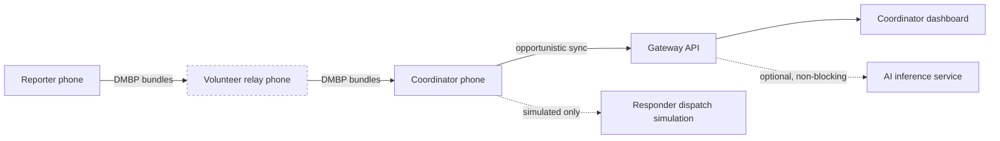
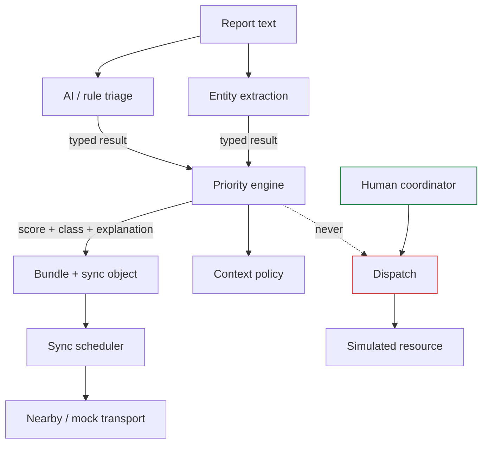

# Architecture

**As built.** Every component described here exists and runs, except where marked
NOT COMPILED. Check [DEVELOPMENT_STATUS.md](DEVELOPMENT_STATUS.md) for the evidence.

## System context



The phone-to-phone link is the only one assumed to exist. Everything to the right of
the coordinator is optional and may be absent for an incident's entire life.

## Layers and their boundaries

| Layer | Responsibility | Must not | Where |
|---|---|---|---|
| UI | Render state, capture intent | Hold business logic or touch the DB | `dashboard/src`, `android-app/.../ui` |
| Domain | Incident, priority, lifecycle, policy | Import Android or transport types | `protocol/dms/domain`, `dms/priority` |
| Data | Persistence, attachment files | Be reached from UI directly | `protocol/dms/store` |
| Protocol | Bundles, inventory, dedup | Know about radios | `protocol/dms/protocol` |
| Transport | Nearby Connections / mock | Leak into the domain | `protocol/dms/transport` |
| Sync | Priority-aware scheduling | Bypass access policy | `protocol/dms/sync` |
| AI | Transcribe, triage, extract, embed, translate | Decide anything | `protocol/dms/ai`, `ai-service` |
| Governance | Roles, permissions, audit, crypto | Be optional on a sensitive path | `protocol/dms/governance`, `dms/crypto` |

The boundaries are load-bearing, not decorative: the sync engine is fully tested
without a radio because transport is abstracted, and the priority engine is
deterministic because no model handle can reach it.

## The decision path



The dotted line is the architecture's whole point: no path exists from inference to
action. A human is the only edge into dispatch.

## Component notes

**MeshNode** (`dms/node.py`) is the composition root: identity, store, keystore,
transport, scheduler, audit log. It is the only class that knows about all of them, and
it is roughly 600 lines because everything it composes is independently testable.

**Emergency Sync Engine** — four queues (P0–P3). Selection weighs class, payload rank,
expiry urgency, score, size, and attempts, gated by authorization and battery. Every
object considered — selected or rejected — produces a `SchedulingDecision` with a
reason, a policy version, and a timestamp.

**File transfer** — manifest before content, fixed chunking, resumable ranges,
SHA-256 verified in quarantine, atomic rename on commit, `0600`, never executed.

**AI service** — FastAPI, mock adapters by default, real models behind feature flags.
Every response carries model name, version, and input hash. `/health` says the process
is up; `/ready` says whether models are loaded. They are deliberately different questions.

**Gateway** — org-scoped, role-gated, idempotent. Stores the canonical domain document
(ADR-0006). Cross-organisation reads return 404, not 403.

**Dashboard** — three columns: queue, incident, actions. Zod-validated at the boundary,
so a server that changes shape fails loudly instead of rendering `undefined` at a
coordinator.

## Degraded modes

| Missing | Behaviour | Test |
|---|---|---|
| Internet / gateway | Full local + mesh operation; bundles queue | `test_10_the_whole_flow_ran_with_no_internet` |
| AI service | Rule triage and priority; original input untouched | `test_incident_reporting_works_with_ai_unavailable` |
| Backend | Coordinator phone is the authority; sync reconciles idempotently | `test_sync_push_is_idempotent` |
| Nearby radios | Capture and queueing continue; the UI says so plainly | relay screen states |
| Low battery | P3 sheds first, P0 last | `test_low_battery_relay_still_moves_p0_text` |
| A dropped link mid-transfer | Resumes on next contact from missing chunks | simulator scenario 8 |

## Security boundaries

```
device keystore  ↔  app          Ed25519 signing key never leaves the device
app              ↔  relay        ciphertext + routing metadata only
coordinator      ↔  gateway      bearer auth, organisation-scoped
gateway          ↔  AI service   no raw payload in normal logs
human            ↔  dispatch     explicit authorized confirmation, always
```

## Future integration boundaries

Real emergency service integration, public alerting beyond the authorization gate,
cross-organisation federation, and cloud inference over sensitive data are all
human-approval gates listed in CLAUDE.md §9. None is implemented, and each would need
its own threat-model entry before it is.
