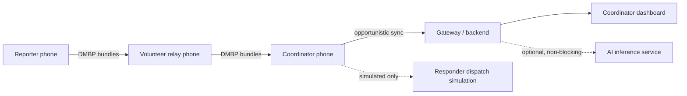

# Architecture

**Status: target architecture. Nothing below is implemented yet.**
Check `docs/DEVELOPMENT_STATUS.md` before relying on any statement here.
The full audit and phased plan land in `docs/IMPLEMENTATION_PLAN.md` (Prompt 02).

## System context

The link from phone to phone is the only one assumed to exist. Every link to the
right of the coordinator is optional and may be absent for the entire incident.

## Layers

| Layer | Responsibility | Must not |
|---|---|---|
| UI | Render state, capture intent | Hold business logic or touch the DB |
| Domain | Incident, priority, lifecycle, policy | Import Android or transport types |
| Data | Room persistence, attachment files | Be reached from UI directly |
| Protocol | DMBP bundles, inventory exchange, dedup | Know about radios |
| Transport | Nearby Connections / mock | Leak into the domain model |
| Sync | Priority-aware scheduling of transfers | Bypass access policy |
| AI | Transcribe, triage, extract, embed, translate | Decide anything |
| Governance | Roles, permissions, audit, crypto | Be optional on a sensitive path |

## Component notes (planned)

**Mobile** — Kotlin, Jetpack Compose, Room, Coroutines/Flow, WorkManager, Keystore,
Hilt, Material 3. One app, three role-driven experiences: reporter, relay, coordinator.

**DMBP** — transport-independent bundle protocol. Immutable bundle ID and payload
hash, monotonic hop count, hard expiry, replication limit, signed header,
authenticated-encryption payload, recorded path. Critical text is a bundle
independent of its attachments so media can never block it.

**Emergency Sync Engine** — four queues (P0/P1/P2/P3). Selection weighs priority
class and score, expiry urgency, receiver role, geographic relevance, object size,
battery budget, and replication budget. Every decision — selected or rejected — is
recorded with a reason and a policy version.

**File transfer** — manifest before content, chunked with resumable ranges,
SHA-256 verified in a temp location, atomic rename on commit. Size and MIME enforced.
Nothing received is ever executed.

**AI service** — FastAPI, mock adapters first, real models behind feature flags.
Every response carries a model version and an input hash. Failure returns a
structured error and the pipeline continues on rules alone.

**Governance** — explicit role/permission matrix, organization scoping, expiring
responder credentials, revocation, tamper-evident event log. Relays carry ciphertext
and routing metadata; they are not readers.

## Degraded modes

| Missing | Behavior |
|---|---|
| Internet / gateway | Full local + mesh operation; bundles queue for later sync |
| AI service | Rule-based triage and priority; original input preserved untouched |
| Backend | Coordinator phone is the authority; sync reconciles idempotently |
| Nearby radios | Local capture and queueing continue; UI states this plainly |
| Low battery | Non-critical transfers shed first; P0 text is shed last |

## Security boundaries

Device keystore ↔ app · app ↔ relay (ciphertext + metadata only) · coordinator ↔
gateway (authenticated, org-scoped) · gateway ↔ AI (no raw sensitive payload in
normal logs) · human ↔ dispatch (explicit authorized confirmation, always).
