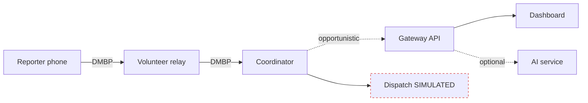
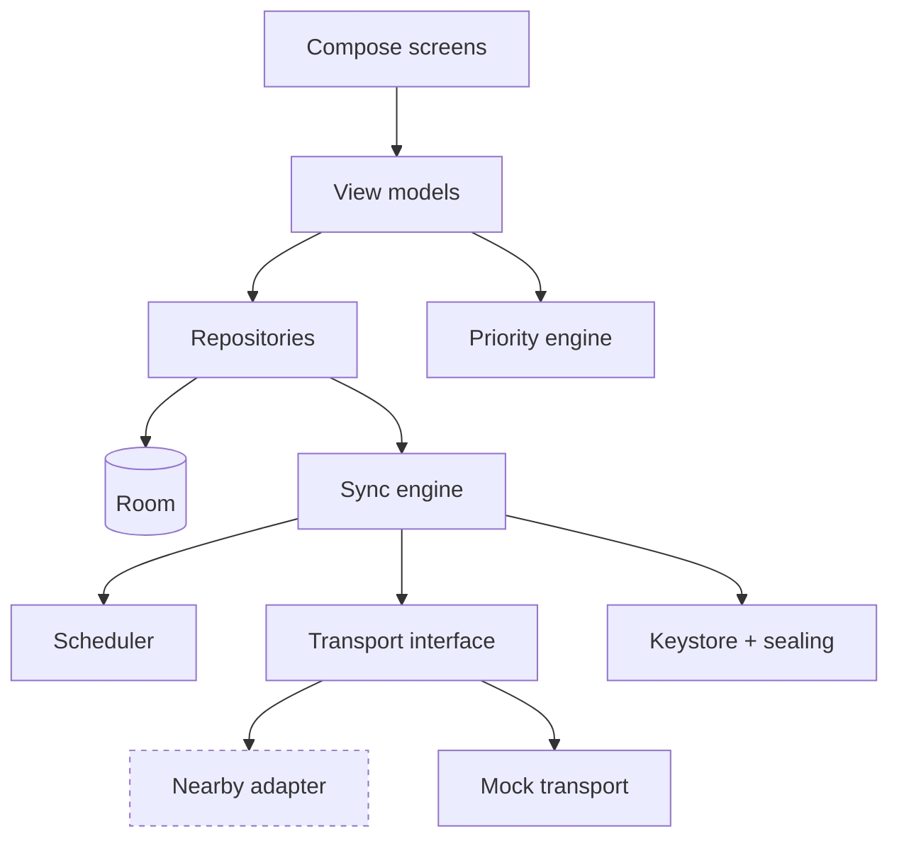
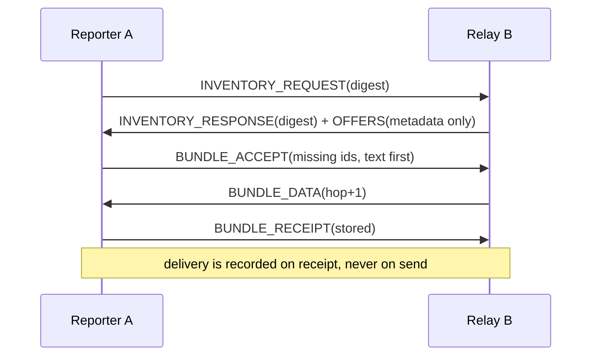
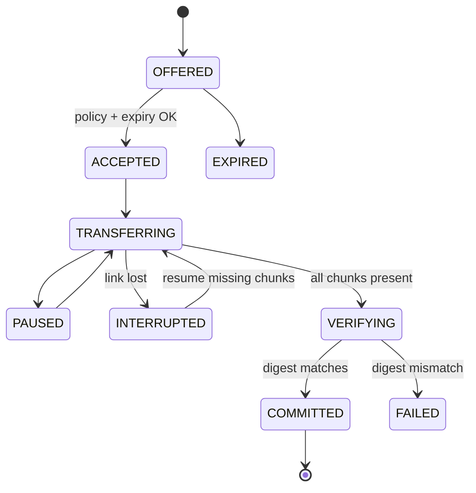
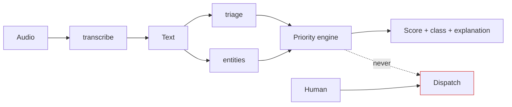
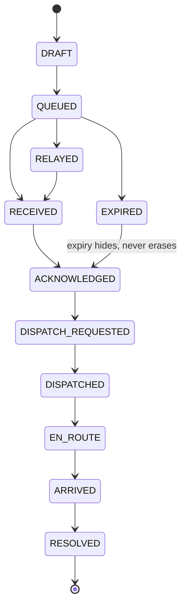
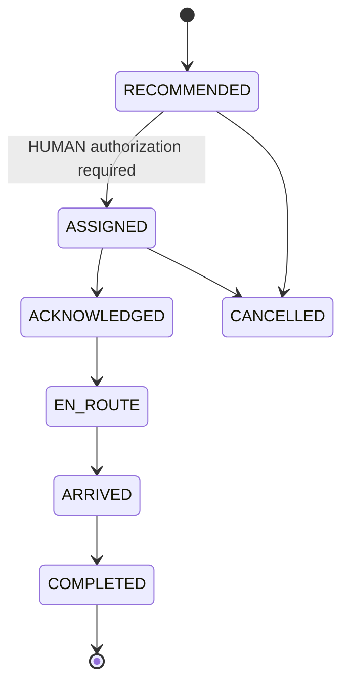
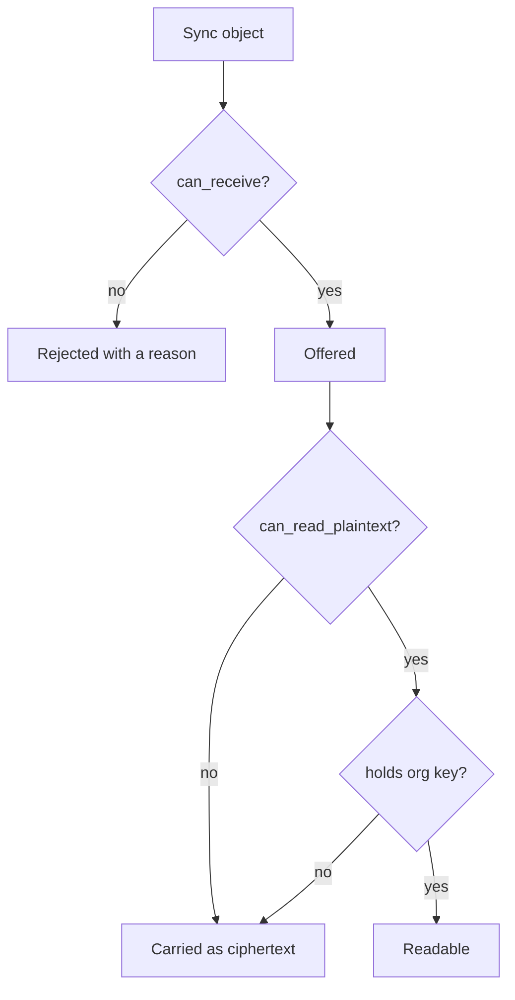
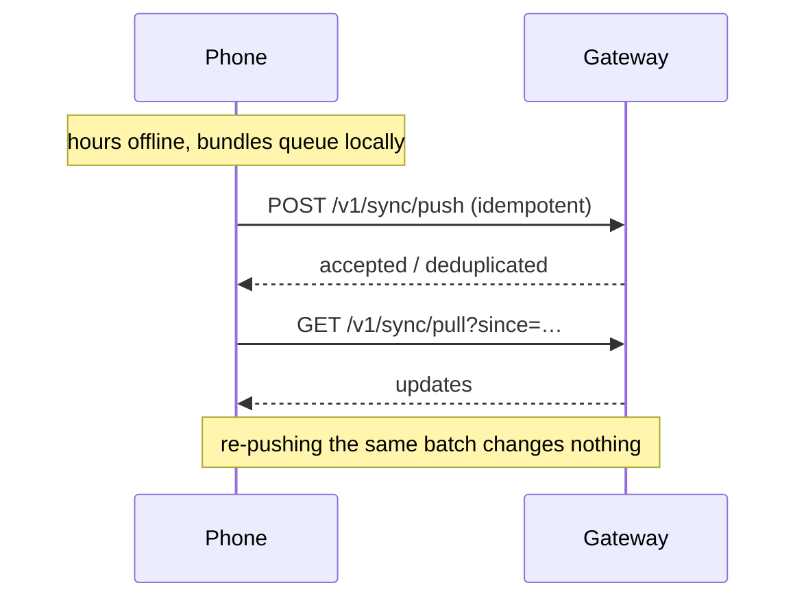
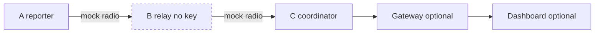

# Diagrams

Every diagram reflects the code as built. Simulated and unbuilt components are labelled.

## 1 · System context

## 2 · Mobile components — NOT COMPILED

## 3 · DMBP exchange

## 4 · File transfer state machine

## 5 · AI pipeline

## 6 · Incident lifecycle

## 7 · Dispatch lifecycle — all simulated

## 8 · Governance

## 9 · Offline to gateway

## 10 · Demo topology

